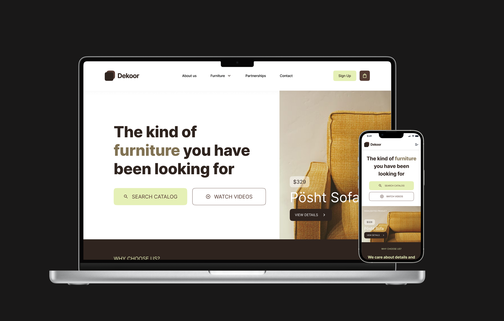

# SkwnFrontendDev-1-FarahFairuz

## Dekoor - Furniture Landing Page

A modern responsive furniture landing page built with React, Vite, CSS, and jQuery. The project showcases a beautifully designed interface for a furniture company with responsive layouts and smooth animations.



## 🚀 Live Demo

Visit the live demo at: [https://skwn-frontend-dev-furniture.vercel.app](https://skwn-frontend-dev-furniture.vercel.app)

## 🛠️ Technologies Used

- React 18
- Vite
- jQuery
- CSS3
- Mock API for product data
- Vercel for deployment

## 🏁 Getting Started

### Prerequisites

- Node.js (v14.0.0 or later)
- npm or yarn

### Installation

1. Clone the repository
   ```bash
   git clone https://github.com/farah-bot/SkwnFrontendDev-1-FarahFairuz.git
   cd SkwnFrontendDev-1-FarahFairuz
   ```

2. Install dependencies
   ```bash
   npm install
   # or
   yarn
   ```

3. Start the development server
   ```bash
   npm run dev
   # or
   yarn dev
   ```

4. Open your browser and navigate to `http://localhost:5173`

## 🚀 Build for Production

```bash
npm run build
# or
yarn build
```

The build files will be in the `dist` directory, ready to be deployed.

## 📂 Project Structure

```
├── src/
│   ├── api/              # API service for furniture data
│   ├── assets/           # Static assets
│   ├── components/       # React components
│   ├── styles/           # CSS styles
│   ├── hooks/            # Custom React hooks
│   ├── utils/            # Utility functions
│   ├── App.jsx           # Main App component
│   └── main.jsx          # Entry point
└── public/               # Public assets
```
